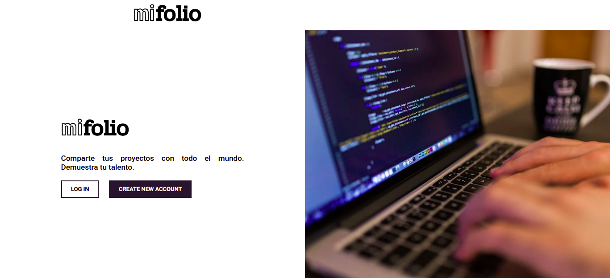

# Mi Folio App - Distributed Systems Project 

Mi Folio App is an educational project for the distributed systems course created with Express and Handlebars.

## 🚀 Installation
**Clone the repository**

`git clone https://github.com/JoseCortezz25/distributed-systems-project.git`

**Install dependencies**

`npm install`

**Run the project**

1. `npm run dev`
2. `npm run start`

## 🛠 Build with 
1. NodeJS with Express
2. Template Engine with Handlebars